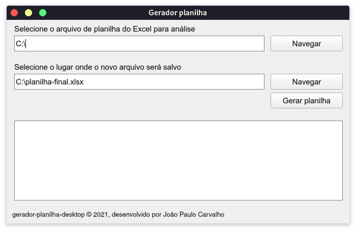
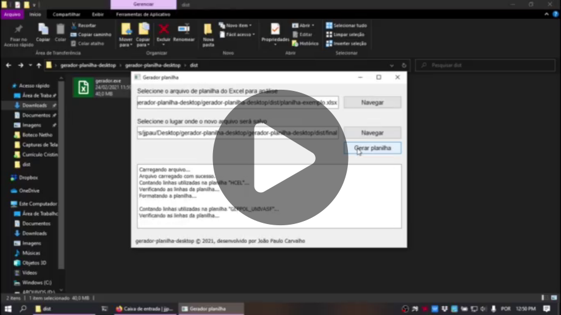

# Gerador de Planilhas (desktop)

Programa para desktop escrito em Python que lê uma planilha do Excel com uma estrutura pré definida e gera uma nova planilha resultante com os dados finais para análise.

Peço que **leia atentamente toda esta descrição** antes de fazer uso deste software para evitar erros e frustrações. Em caso de problemas e sugestões de modificações, sinta-se a vontade para abrir uma [Issue neste repositório](https://github.com/jjpaulo2/gerador-planilha-desktop/issues) ou entrar em contato particularmente comigo. Se você não for programador, pode ignorar a seção [sobre o código-fonte](#sobre-o-código-fonte).

### Licença

Software devidamente licenciado sob a [`Licença MIT`](./LICENSE.md). A licença permite:

- Uso comercial
- Modificações
- Distribuição livre

### Download

O programa possui versões pré-compiladas para **Windows** e **Linux**. Para fazer download do software, consulte a página [**`releases`**](https://github.com/jjpaulo2/gerador-planilha-desktop/releases).

[**CLIQUE AQUI PARA FAZER DOWNLOAD**](https://github.com/jjpaulo2/gerador-planilha-desktop/releases)


### Exemplo de uso

O uso do programa é bem intuitivo. Existem três botões na tela. Clique no primeiro botão "Navegar" para selecionar o arquivo de planilhas (extensão .xlsx) que será processado. Depois, clique no segundo para definir o lugar onde será salvo o novo arquivo.

Após isso, clique no botão "Gerar planilha" e o programa irá ler a planilha inserida e salvar a nova no lugar escolhido. Logo após a planilha será aberta com o programa padrão (Microsoft Excel, ou Libre Calc, por exemplo).



Se ainda assim sobrarem dúvidas sobre o funcionamento do programa, você pode assistir o seguinte vídeo que mostra na prática tudo acontecendo. Você pode obter o arquivo utilizado no vídeo clicando [aqui](https://www.dropbox.com/scl/fi/aiwao0801exyeacwqqgwo/planilha-exemplo.xlsx?dl=0&rlkey=g308h7es1d4m406ryen4v61m9).

[](https://www.dropbox.com/s/fdhlcnzpm74infq/exemplo-uso.mp4?dl=0)

### Estrutura das planilhas

Antes de utilizar o programa, é preciso que você esteja ciente da estrutura que as planilhas devem obedecer. 

#### **1. Planilha que será analisada**

Esta planilha será feita por você. Portanto, garanta que ela esteja na seguinte estrutura, pois a extração dos dados dela depende disso. [Veja este exemplo](https://www.dropbox.com/scl/fi/aiwao0801exyeacwqqgwo/planilha-exemplo.xlsx?dl=0&rlkey=g308h7es1d4m406ryen4v61m9).

<div style="overflow-x: scroll">
    <table>
        <thead>
            <th colspan="5">NOME DO GRUPO</th>
            <td>
                <strong>N/A</strong>
            </td>
            <th colspan="8">AVALIAÇÃO</th>
        </thead>
        <tr>
            <td rowspan="2">PESQUISADOR (NOME DO PESQUISADOR VINCULADO AO GRUPO)</td>
            <td rowspan="2">OBRA (COPIAR TODA A DESCRIÇÃO DO LATTES)</td>
            <td rowspan="2">ANO DE PUBLICAÇÃO (DE 2015 A 2019)</td>
            <td rowspan="2">TIPO (LIVRO, CAPITULO OU ARTIGO EM PERIÓDICO)</td>
            <td rowspan="2">OBSERVAÇÕES</td>
            <td rowspan="2">
                <strong>N/A</strong>
            </td>
            <td colspan="2">APRESENTA UMA AVALIAÇÃO CONCRETA DE P.P.?</td>
            <td rowspan="2">QUAL A METODOLOGIA DE AVALIAÇÃO UTILIZADA?</td>
            <td rowspan="2">QUAIS INDICADORES FORAM UTILIZADOS NA AVALIAÇÃO?</td>
            <td colspan="3">QUAL O NÍVEL DA POLÍTICA AVALIADA?</td>
            <td rowspan="2">QUAIS INDICADORES SÃO CONSIDERADOS NO ESTUDO?</td>
        </tr>
        <tr>
            <td>SIM</td>
            <td>NÃO</td>
            <td>MUNICIPAL</td>
            <td>ESTADUAL</td>
            <td>FEDERAL</td>
        </tr>
    </table>
</div>
<br/>

#### **2. Planilha final gerada**

Esta planilha será gerada pelo programa, então não precisa se preocupar. Se tudo ocorrer de forma esperada, será gerada uma planilha que obedece a seguinte estrutura.

<div style="overflow-x: scroll">
    <table>
        <tr>
            <td>nº</td>
            <td>GRUPO</td>
            <td>OBRA</td>
            <td>ANO</td>
            <td>TIPO</td>
            <td>NÍVEL DA POLÍTICA</td>
            <td>
                <strong>N/A</strong>
            </td>
            <td>TIPO DE AVALIAÇÃO</td>
            <td>TIPO DE INDICADOR</td>
            <td>PERSPECTIVA DO INDICADOR</td>
            <td>VARIÁVEIS RELACIONADAS</td>
        </tr>
    </table>
</div>
<br/>

## Sobre o código-fonte

Algumas informações para desenvolvedores. O programa foi feito utilizando unicamente **Python**. As janelas foram construídas com **PySimpleGUI** (Qt) e os executáveis gerados com **PyInstaller**.

### Dependências

O projeto foi escrito com **Python 3.9** e as dependências gerenciadas via **Pipenv**. As bibliotecas utilizadas foram:

- openpyxl (3.0.6)
- pysimpleguiqt (0.35.0)
- pyinstaller (4.2)

Existe um [Makefile](./Makefile) que automatiza esse processo. Se preferir utilizá-lo, veja a seção [Instruções de build](#instruções-de-build).

Se desejar apenas instalar as dependências, execute o seguinte comando.

```shell
$ pipenv install
```

### Instruções de execução

Para executar o programa via linha de comando, basta executar os seguintes comandos.

```shell
$ pipenv shell
Launching subshell in virtual environment...

$ python -m gerador_planilha_desktop
```

### Instruções de build

O [Makefile](./Makefile) contém instruções para instalar as dependências e fazer a build da aplicação.

- Instalar dependências e fazer a build
```shell
$ make all
```

- Apenas instalar dependências
```shell
$ make prepare
```

- Apenas fazer build do projeto
```shell
$ make binary
```
